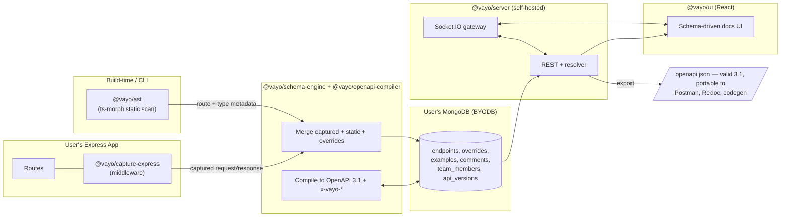
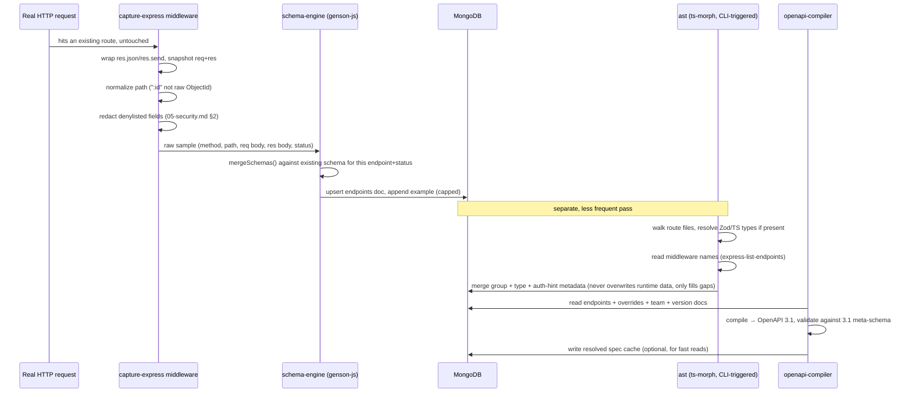
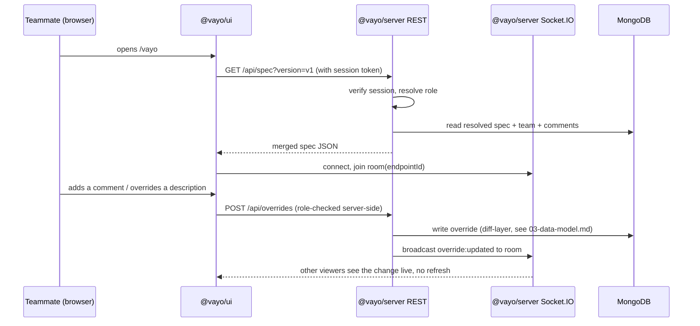

# 02 — Architecture

## System diagram

## Two flows, explained separately

### Flow A — Build-time (how a spec comes to exist)

### Flow B — Runtime (how a person actually uses it)

## Why the compiler and UI must stay framework-agnostic

`schema-engine`, `openapi-compiler`, `db-mongo`, `server`, and `ui` never import
anything from `capture-express`. They only ever consume the **generic capture
format** defined in `03-data-model.md`. This is the one architectural rule that
makes "MERN only for v1, other stacks later via community contribution" actually
true rather than aspirational — a future `capture-fastify` package only needs to
emit the same generic format; it never touches the compiler or UI.

## Deployment shape (v1)

Single Node.js process runs `@vayo/server`, which:

- serves the REST API,
- serves the built React UI as static assets,
- hosts the Socket.IO gateway,
- connects to the user's MongoDB URI.

This is the same process the user's own API can run in-process — mounted
directly into their own already-running Express app and `http.Server` via
`ServerOptions.httpServer`, the same one-liner ergonomics as
`app.use("/docs", swaggerUi.serve, swaggerUi.setup(spec))` — or as a
separate process pointed at the same database (`vayo serve`); both are
supported, and neither requires a second port for the in-process case. See
`08-packages-and-repo-structure.md` for the `@vayo/server` contract covering
both modes, and `06-realtime-collaboration.md` for how the Socket.IO gateway
avoids colliding with a host app's own WebSocket server when the two share
one `http.Server`.
