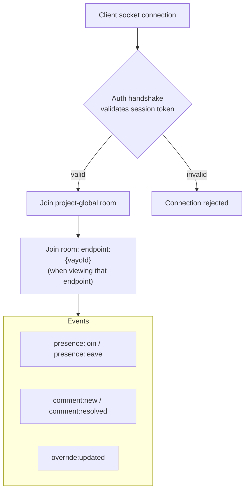

# 06 — Realtime Collaboration

v1 scope, per your call: full realtime (Socket.IO presence + live comments), not
deferred.

## Naming note: "Team Chat," not "comments"

The UI presents this feature as a **Team Chat** tab per endpoint, not a generic
comment box — same `vayo_comments` backend (`03-data-model.md`), same event
contract below, just framed as a running conversation scoped to that one
endpoint rather than a detached review thread. `resolved` still exists on each
message (`03-data-model.md`'s `CommentDoc`) so a team can mark a discussion
settled without needing a separate "resolve" concept bolted on top of chat —
a resolved message stays visible in the thread but visually deemphasized,
rather than disappearing, since the point of the History tab (`03-data-model.md`
§`vayo_audit_log`) is that nothing about an endpoint's past silently vanishes.

This still isn't a generic sitewide comment box even with cross-cutting
messages in the picture (`03-data-model.md`'s `CommentDoc.vayoIds`): a
message tagging 3 endpoints is still a real conversation *about those 3
endpoints specifically*, not a detached announcements channel — it shows up
in each of their own Team Chat tabs, and the header's cross-endpoint chat
drawer is scoped to exactly these cross-cutting threads, not every message
in the project. The naming and the framing both hold; only the "how many
endpoints can one message be about" number changed, from always-1 to 1-or-more.

`replyToId` (`03-data-model.md`) keeps this framing intact rather than
undermining it: a reply renders as a quoted reference to its target within
the same flat, chronological list, not a separate nested thread view. It
solves a real, distinct problem — two teammates with different opinions on
the same message both being able to reply *to that message* — without
turning "one running conversation" into "a tree of sub-conversations."

## Topology

Socket.IO server is embedded inside `@vayo/server` — same process, same
deployment unit, for v1. Single instance is sufficient at the scale this product
targets (one team's internal docs, not a multi-tenant SaaS), so there is no
Redis adapter / horizontal-scaling requirement yet. Document this as the
upgrade path if it's ever needed (§5), but do not build it now — it's
unjustified complexity for the target usage pattern.

## Mounting into a host app, and avoiding a Socket.IO conflict when doing so

`createServer()` defaults to a fully standalone `app` + `http.Server` (what
`vayo serve` runs) — but `ServerOptions.httpServer` lets a host app hand
`createServer()` its own already-created `http.Server` instead, so Vayo
mounts in-process with no second port: `hostApp.use(vayoApp)` (no path
needed — `vayoApp` already only answers under its own `mountPath`
internally), then the host keeps calling its own single `httpServer.listen(port)`
exactly as before. The same ergonomics as
`app.use("/docs", swaggerUi.serve, swaggerUi.setup(spec))`.

Sharing one `http.Server` this way is exactly the scenario where a
real-world Node app is most likely to *already* run its own WebSocket or
Socket.IO server — so Vayo's own Socket.IO path is never Engine.IO's bare
`/socket.io` default: it's `${mountPath}/socket.io` (e.g. `/docs/socket.io`),
overridable directly via `ServerOptions.socketPath`. Since `mountPath` is
already guaranteed distinct from whatever the host uses for its own routes,
namespacing the socket path under it makes an accidental collision with the
host's own (almost certainly still-default-pathed) socket server unlikely
without either side doing anything extra.

As a backstop, not a guarantee — Node can only tell you *that* an `upgrade`
listener already exists on a given `http.Server`, not which path it answers
to — `createServer()` checks `httpServer.listeners("upgrade").length` right
before attaching its own Socket.IO server, whenever `options.httpServer` was
provided (a freshly-created one, the default, can't possibly have one yet).
If it finds one already there, it logs a `console.warn` naming the exact
path Vayo is about to use and suggesting a distinct `socketPath`/`mountPath`
— so if a conflict *does* happen, it's a loud, explained one at startup, not
a silently-dropped connection discovered later.

## Rooms

- **`project` room** — every connected socket joins this. Powers the sidebar's
  "3 teammates viewing" style global presence count, `notification:new`
  (below), and — only when a comment's `vayoIds` has 2+ entries — `comment:new`
  too, so the header's cross-endpoint chat drawer (`03-data-model.md`'s
  "cross-cutting" comments) updates live without joining any specific
  endpoint room. An ordinary single-endpoint comment is *not* rebroadcast
  here — only its own `endpoint:{vayoId}` room, same as always — so this
  stays cheap for the common case.
- **`endpoint:{vayoId}` room** — joined/left as a user navigates between
  endpoints in the UI. Scopes comment and override events to people actually
  looking at that endpoint, so the whole team isn't re-rendering on every edit
  anywhere in the spec. A cross-cutting comment is emitted to *every* one of
  its `vayoIds`' rooms, not just one — each tagged endpoint's own Team Chat
  tab needs to see it live too.

## Event contract

| Event | Direction | Payload | Server-side check before broadcasting |
| --- | --- | --- | --- |
| `presence:join` | client→server→room | `{ vayoId, memberId }` | session valid |
| `presence:leave` | client→server→room | `{ vayoId, memberId }` | — |
| `comment:new` | client→server→room(s) | in: `{ vayoId, body, flagged?, replyToId?, attachmentIds? }`; broadcast: the full `CommentDoc` (`vayoIds: string[]`, derived from `vayoId` plus any `#[path](vayoId)` tags in `body`) | role ≥ `viewer` (viewers can comment, not override) |
| `comment:resolved` | client→server→room | `{ commentId }` | role ≥ `editor` |
| `comment:flagged` | server→room only | `{ commentId, flagged }` | — (REST-only trigger, `PATCH /api/comments/:id/flag`, role ≥ `viewer`; broadcast so other viewers see the flag toggle live) |
| `override:updated` | client→server→room | `{ vayoId, fieldPath, value, updatedBy }` | role ≥ `editor` (§4/§6 of `05-security.md`) |
| `notification:new` | server→`project` room only | `{ type, vayoId }` | — (fired alongside `comment:new`/`override:updated`/a version-status PATCH/db-mongo's `upsertEndpoint`; see "Notifications" below) |

**Socket.IO is a transport, not a source of truth.** Every one of these events
also goes through the equivalent REST write (`POST /api/comments`,
`POST /api/overrides`) inside the same handler — the socket event is emitted
*after* the DB write succeeds, never instead of it. This means:

- A client that reconnects after a drop just re-fetches current state via REST
  and doesn't need any special "catch-up" socket protocol.
- Running two instances of `@vayo/server` behind a load balancer without the
  Redis adapter degrades gracefully to "presence/live-update might miss a
  cross-instance event" while writes/reads through Mongo stay fully correct —
  an acceptable v1 tradeoff, not silently broken data.

## Notifications

The header bell (`vayo_notifications`, `03-data-model.md`): a team member
shouldn't have to visit every endpoint's History tab individually to find out
what changed while they were away. Scope is deliberately automatic-only —
overrides, schema changes, new comments, and version status changes — not a
hand-authored announcement feature (a real, considered alternative; automatic
tracking was chosen as the higher-value v1 scope).

Real-time delivery has one honest gap: `override`/`comment`/`version_status`
notifications are created inside `@vayo/server` (which already has the
Socket.IO `io` instance in scope) and broadcast immediately via
`notification:new` to the `project` room. `schema_change` notifications,
however, are created inside `db-mongo`'s `upsertEndpoint` — called from
`capture-express`, running inside the *user's own app process*, which has no
Socket.IO server to broadcast through. A schema-change notification is
therefore only "eventually visible" (the next time a client fetches
`GET /api/notifications`, e.g. on its next bell-open or page load), not
instantly pushed — an acceptable v1 tradeoff given the same "Socket.IO is a
transport, not a source of truth" principle above; nothing is lost, it's just
not always live.

A `schema_change` notification is only created when a *previously known*
endpoint's schema actually changes — not on that endpoint's very first
captured sample, which is a discovery, not a change (`03-data-model.md`).

## Concurrent-edit handling

`vayo_overrides` (`03-data-model.md`) is keyed by `targetId` (one document
per field). Two editors changing the *same* field within the same few seconds is
rare but must not corrupt data:

1. Last `updatedAt` wins at the database level (simple, no operational
   transforms needed for a field-level, low-frequency edit pattern like this —
   this is not a collaborative text editor).
2. The UI, on receiving an `override:updated` event for a field the current user
   is actively editing, shows a non-blocking "Riya just updated this — reload
   to see her version" notice rather than silently overwriting what's in the
   user's input box.

## Presence UI data

Presence is ephemeral and does not need to survive a server restart — keep it
in-memory in `@vayo/server` (a `Map<vayoId, Set<memberId>>`), not in
Mongo. Losing presence state on a restart is a non-event (everyone's client
reconnects and rejoins within seconds); persisting it would be complexity spent
on a problem that doesn't exist.

**Global online/offline** (distinct from the per-`vayoId` map above, which is
"who's viewing *this* endpoint") backs the Team modal's "online now" / "last
seen" display. A second, separate in-memory `Map<memberId, number>` in
`realtime.ts` counts open sockets per member — a member with two tabs open
only goes offline once *both* close. State changes:

- A member's first socket connecting broadcasts `presence:online` to the
  `"project"` room.
- Every freshly-connected socket is told who's *already* online via a
  `presence:online-list` event sent to itself only (not broadcast) — the only
  way to learn about existing state rather than future changes.
- A member's last socket disconnecting broadcasts `presence:offline` (with a
  `lastSeenAt` timestamp) and persists that same timestamp to
  `TeamMemberDoc.lastSeenAt` — the one piece of this whole scheme that
  *does* need to survive a restart or a member simply not being online when
  someone else looks at their profile.

## Future scaling note (not built now)

If a later version needs multiple `@vayo/server` instances behind a load
balancer, Socket.IO's official Redis adapter is the standard upgrade —
mentioned here only so nobody re-derives this from scratch later, not as
something to build in v1.
