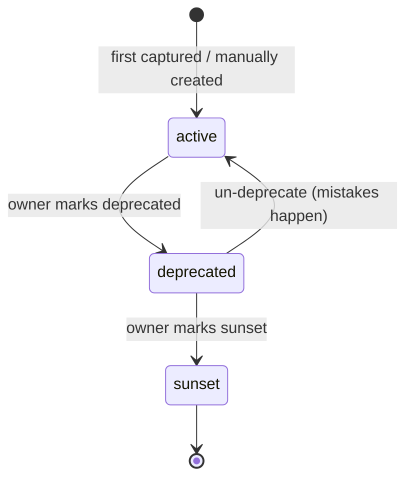

# 07 — API Versioning

## Versions are siblings, never overwrites

Each `EndpointDoc` (`03-data-model.md`) carries a `version` field. Two versions
of "the same" logical endpoint (`GET /api/users/:id` in v1 and v2) are two
entirely separate documents with two separate `vayoId`s — there is no
"latest wins" mutation of a single record. This is what makes both versions
permanently browsable rather than v2 silently replacing v1's history.

## Resolving version from a captured request

`vayo_api_versions.basePathPattern` (e.g. `/api/v{n}`) is matched against the
normalized path template at capture time (`04-capture-engine.md` step 1),
via `@vayo/schema-engine`'s `resolveVersion(pathTemplate, configuredVersions)`.
If no pattern matches, samples fall into an implicit `"unversioned"` bucket —
surfaced in the UI so it's obvious rather than silently dropped.

This only applies once at least one version has been configured. With zero
`vayo_api_versions` documents — every install's state before anyone opens
"Manage versions," including a fresh `apps/demo-app` — falling back to
`"unversioned"` would silently break the zero-config capture behavior every
other doc assumes. So `resolveVersion` keeps today's regex heuristic
(`/v(\d+)/` in the path → `vN`, else `"v1"`) as long as `configuredVersions`
is empty; `"unversioned"` specifically means "you've configured explicit
versions, but this route matches none of them," not "no versions exist yet."

## Version lifecycle

`deprecated` and `sunset` states only affect UI presentation (banners, sort
order) — they never delete or hide the underlying `EndpointDoc`s. A sunset
version's docs should still be readable; teams frequently need to answer "what
did v1 used to do" long after v2 ships.

Every transition on this diagram also creates a `version_status` notification
(`06-realtime-collaboration.md` "Notifications") — this is exactly the
"a set of APIs is changing because of a business decision" signal a team
needs to notice, not just something visible to whoever happens to open the
Versions panel that day.

**This is a separate concept from `EndpointDoc.deprecated`**
(`03-data-model.md`, `04-capture-engine.md` Step 2 #4a) — that flags one
specific *route* deprecated, independent of its version's own lifecycle
here: a single superseded endpoint (e.g. a legacy search route replaced by
a newer one) can be marked deprecated while `v1` as a whole stays fully
`active`, with every other endpoint in it unaffected.

## Diffing between versions — custom TypeScript diff, not `oasdiff`

This doc originally called for shelling out to `oasdiff`. In practice `oasdiff`
is Go-only — distributed as platform binaries, a Docker image, or a Homebrew
formula, with no npm package and no WASM build. Pulling a Go binary into a
Node/TypeScript monorepo (process-spawn, PATH detection, platform-specific
install) is a worse fit than a small purpose-built diff, so `@vayo/openapi-
compiler` implements its own `diffSpecs(specA, specB, options)` instead. It's
deliberately scoped to exactly the "what counts as changed" rules below —
this is a "will this break an integration" check, not a general-purpose
semantic OpenAPI-diff engine. Flow:

1. `openapi-compiler` produces a valid OpenAPI 3.1 document per version
   (`02-architecture.md`, Flow A).
2. When a user opens the "Compare versions" view, `@vayo/server`'s
   `GET /api/diff?from=&to=` compiles both versions (reusing the same
   `compile()` + `resolveEndpoint` pipeline as `/api/spec`) and calls
   `diffSpecs`, passing each version's `basePathPattern` as a prefix to strip
   before matching operations — this is what lets `/api/v1/widgets` and
   `/api/v2/widgets` be recognized as the same logical operation across
   versions rather than two unrelated ones.
3. The result — added / removed / changed operations, with a list of
   human-readable change strings per changed operation — is what powers the
   diff view's added/removed/changed sections.
4. No caching layer in v1: `/api/spec` itself isn't cached today either, and
   the diff is a cheap pure-object comparison over two already-compiled
   documents, not a recompilation. Add caching later only if this proves to
   matter in practice.

## What counts as "changed" for the diff badge

`diffSpecs` flags exactly: added/removed operations, added/removed required
fields, type changes, added/removed enum values (recursively, through nested
object properties and array items, across both request bodies and JSON
responses). Purely cosmetic diffs (a reordered property, a description-only
override, a newly-added *optional* field) do not trip the "changed" badge —
only structural/contract differences matter here, since the badge's job is
"will this break an integration," not "did anything at all change."
