# 09 — Roadmap

Sequenced so each milestone produces something demonstrable, and so the highest-
risk, most differentiated part (capture → real schema) is proven before time is
spent on anything downstream of it.

```mermaid
gantt
    title Vayo v1 build sequence
    dateFormat  X
    axisFormat %s
    section Foundation
    M0 Monorepo + types + db-mongo + CLI skeleton      :m0, 0, 2
    section Core differentiator
    M1 Capture middleware + schema inference            :m1, after m0, 3
    M2 OpenAPI compiler + overrides                      :m2, after m1, 2
    section Server
    M3 REST API + auth + RBAC                            :m3, after m2, 2
    M4 Realtime (Socket.IO presence + comments)          :m4, after m3, 2
    section Product surface
    M5 Full custom React UI                              :m5, after m4, 3
    M6 API versioning + spec diffing                      :m6, after m5, 1
    section Launch
    M7 Docs, CONTRIBUTING, security pass, npm publish     :m7, after m6, 1
```

## M0 — Foundation

- pnpm monorepo scaffolded per `08-packages-and-repo-structure.md`.
- `@vayo/types` with every interface from `03-data-model.md`.
- `@vayo/db-mongo` with `runMigrations` creating all `vayo_*` collections
  and indexes.
- `vayo`'s `vayo init` working end-to-end against a real MongoDB URI.
- **Done when:** running `vayo init` against a fresh Mongo Atlas free-tier
  instance produces all expected collections with correct indexes.

## M1 — Capture core (the highest-risk milestone — do not skip ahead)

- `capture-express` middleware capturing real traffic on the `demo-app`.
- `schema-engine`'s `mergeCapturedSample` using `genson-js`.
- `ast` package's static pass using `express-list-endpoints` + `ts-morph`,
  including scope detection (`04-capture-engine.md` §3a) and middleware-chain
  capture for the Flowmap tab (`04-capture-engine.md` §4) — both ride along
  with the same static pass, no separate mechanism needed.
- **Done when:** running `demo-app` for a day of manual traffic, then dumping
  `vayo_endpoints`, produces schemas a reviewer agrees are accurate — with
  zero comments/annotations written in `demo-app`'s own code. `scopes` and
  `middlewareChain` should be populated for any route using the demo app's
  own auth/scope-check middleware, without additional config.

## M2 — Compiler + overrides

- `openapi-compiler`'s `compile()`/`validate()` against `@apidevtools/swagger-parser`.
- Override CRUD logic and the pure `resolveEndpoint` merge function, fully unit
  tested with fixtures (re-scan-doesn't-destroy-overrides is the specific case
  to test hardest).
- **Done when:** `vayo export` produces a file that validates as OpenAPI 3.1
  and imports cleanly into Scalar's renderer or Postman without errors.

## M3 — Server, auth, RBAC

- `@vayo/server`'s REST API: spec resolution, overrides, comments, team,
  invites — every mutating route behind `requireRole`.
- Both auth modes from `05-security.md` §5 (delegated + standalone).
- **Done when:** a `viewer`-role session gets a 403 hitting `/api/overrides`
  directly via curl, even though the UI doesn't exist yet to stop them.

## M4 — Realtime

- Socket.IO gateway, rooms, event contract from `06-realtime-collaboration.md`.
- **Done when:** two browser sessions (different roles) see each other's
  comments and overrides live, and the viewer-role session's attempted override
  event is rejected server-side, not just hidden client-side.

## M5 — UI

- `SchemaField`, sidebar, and all five endpoint tabs: Details, Flowmap, History,
  Team Chat, Try It Now — plus slot-based customization points.
- **Done when:** the UI is wired to the real M1–M4 backend end-to-end (not mock
  data) — this replaces the illustrative demo mockup from the earlier planning
  phase with the real thing. Flowmap and History specifically should require
  no new backend work at this point — they're pure rendering over
  `middlewareChain` and `vayo_audit_log`, already populated since M1/M2.

## M6 — Versioning

- `vayo_api_versions`, path-based version resolution, `oasdiff` integration.
- **Done when:** capturing traffic against both a `/api/v1` and `/api/v2` route
  in `demo-app` produces two independently browsable versions with an accurate
  diff badge between them.

## M7 — Launch readiness

- `CONTRIBUTING.md` written specifically so an external contributor can pick up
  a future `capture-fastify` package using only `04-capture-engine.md` and
  `08-packages-and-repo-structure.md`.
- Full pass over `05-security.md` as a literal checklist against the real
  codebase, not just the design.
- License file (MIT, per the fully-open-source stance in `01-vision-and-market.md`),
  npm publish for each package, root README pointing here.
- `vayo create-owner` (`packages/cli`) — found via real npm-tarball testing
  that standalone auth mode had no way at all to create the first login;
  `docs/05-security.md` §5 and `08-packages-and-repo-structure.md`'s
  `vayo` section now document it as the required bootstrap step.
- `bcrypt` bumped `^5.1.1` → `^6.0.0` everywhere it's used
  (`server`/`cli`/`apps/demo-app`) — same hashing API, but 6.x replaced its
  native-build mechanism (`@mapbox/node-pre-gyp` → `node-gyp-build`), which
  removes the vulnerable transitive `tar` dependency entirely. This was a
  real fix, not just a documented limitation: the root `package.json`'s
  `pnpm.overrides` band-aid for it is gone too, since there's nothing left
  to override, and — unlike that override — this travels to real consumers,
  not just this workspace's own install.
- `capture()` (`packages/capture-express`) now warns at startup
  (`unsupportedExpressVersionWarning`) if the consuming app's actually
  installed Express isn't 4.x, instead of relying solely on `npm`'s
  peer-dependency warning, which `--force`/`--legacy-peer-deps` skips
  silently.
- History and Flowmap redesigned after a direct usability complaint, not a
  correctness bug:
  - History previously rendered raw `action` enum badges plus two
    unformatted `JSON.stringify()` before/after blobs — for an `override`,
    with no field name at all (`fieldPath` was computed for the
    notification message but silently dropped from the audit-log entry
    itself, `docs/03-data-model.md`). Fixed at the data layer
    (`AuditLogDoc.fieldPath`) and the presentation layer
    (`packages/ui/src/audit-diff.ts`'s `describeAuditEntry`/`diffLeaves` —
    a plain-language summary plus a leaf-level field diff, with a
    Changes/Team-activity filter).
  - Also removed `"endpoint_visibility"` from `AuditAction` — declared in
    the type and these docs since early on, but never written by any code
    path. Dead enum value, not a real feature quietly cut.
  - Flowmap gained a second section showing which saved Flows (Postman
    Collection Runner-style endpoint sequences, already built for the Try
    It Now tab) this endpoint participates in — see
    `04-capture-engine.md` §4's closing note for why this was cheaper and
    more useful than the from-scratch cross-endpoint inference that section
    used to describe as deferred.
- Team Chat gained reply-to (`CommentDoc.replyToId`, `03-data-model.md`) —
  two teammates with different opinions on the same message can each reply
  to *that message* instead of just appending to the bottom of the thread.
  Deliberately not a nested-thread view: `vayo_comments` stays one flat
  list per endpoint, replies just render a quoted, clickable reference to
  their target (`06-realtime-collaboration.md`'s "Naming note").
- Audited every route's `requireRole` argument (`05-security.md` §4) to
  answer "does this need granular per-action permissions, or more
  predefined roles" — found the 3-role split already clean (`editor` is
  every content-mutation, one job; `owner` is only team administration),
  with no bundled-together concerns to split further. Kept the 3 roles and
  fixed the actual gap instead: the invite/role-change pickers and the
  accept-invite confirmation screen now show what each role actually
  grants (`packages/ui/src/role-descriptions.ts`), which is what
  "can't do granular access" turned out to mean in practice.
- Team Chat: client-side search over the current conversation, a
  right-click context menu (Reply/Flag/Copy) per message, and an "R"
  keyboard shortcut that replies to whichever message is moused over
  (skipped entirely while focus is in a text field).
- Try It Now: a request that fails with `status === 0` (no response at
  all — the classic CORS or unreachable-server symptom, which browsers
  report identically and unhelpfully) now shows a hint naming both likely
  causes and the page's actual origin — the concrete answer to "this works
  in Postman and in Try It Now but not in my own frontend app," since
  Postman isn't subject to CORS at all and Try It Now just happens to run
  from an origin the API's CORS config allows.
- Team Chat gained file/screen-recording attachments (`vayo_attachments`,
  `03-data-model.md`) — real value for "here's what's actually happening"
  bug reports instead of describing it in prose. Uploads immediately (not
  on Send) so several files/recordings can queue as pending chips for one
  message; storage is GridFS in the user's own already-configured MongoDB
  (BYODB), capped at 40MB/file, not a new external storage dependency.
- Considered and explicitly declined: private member-to-member messaging.
  Raised as "message a particular teammate, others can't view it," which is
  a genuinely separate feature from endpoint-scoped Team Chat (its own data
  model, its own privacy/visibility rules, its own top-level UI surface —
  not a chat feature so much as a second communication system alongside
  the one Vayo already has). Built `@mentions` instead
  (`packages/ui/src/mentions.ts`, `@[Name](memberId)` tokens,
  `NotificationDoc.mentionedMemberIds`) — gets a specific person's
  attention and flags their notification bell entry, without opening a
  channel that has nothing to do with the endpoint/schema context that
  makes Vayo's chat worth using over Slack for API-specific discussion in
  the first place.
  - Two bugs only live browser testing caught (both fixed, both now covered
    by a regression test): `GET /api/attachments` (list-by-vayoId) was
    built end-to-end in the adapter, the fake, and the UI client — but the
    actual Express route was never registered, so every real page load
    silently 404'd into the SPA's own HTML fallback and threw trying to
    parse it as JSON. And `NotificationBell` crashed outright the moment a
    notification created *before* `mentionedMemberIds` existed rendered,
    since `undefined.includes(...)` throws — fixed with the same
    `?? []` guard History's redesign already needed for its own
    predates-the-field data.
- Notifications, chat, and endpoint search each got a "find the thing, not
  just be told about it" pass, after feedback that the bell told you
  something happened without taking you to it:
  - Clicking a notification (`NotificationBell` → `DocsApp`'s
    `selectEndpointForNotification`) now switches to the *right tab* for
    that notification's type — Team Chat for a comment, History for a
    schema change, Details for an override — instead of always landing on
    whichever tab happened to already be open. A `comment` notification
    goes one step further: `NotificationDoc.targetId` (the comment's own
    `_id`, `03-data-model.md`) drives an actual scroll-to-and-blink on that
    exact message, reusing the same jump mechanism reply-quotes already
    had. `override`/`schema_change` stop at the right tab rather than a
    specific field — `SchemaField` has no per-field DOM anchors to jump to,
    and building that was judged a much larger, separate piece of work.
  - Team Chat gained All-time/Today/Last-7-days/Last-30-days date filter
    chips (`chat-filters.ts`) alongside the existing text search, so an
    old, long-running endpoint conversation can be narrowed by *when*
    something was said, not just what was said. "Today" is the viewer's
    own local calendar day, not a UTC boundary — correct for a human
    reading it, but it means the test fixtures had to use relative offsets
    from `Date.now()` rather than fixed timestamps, since a fixed
    boundary-of-day fixture is timezone-fragile in a way relative offsets
    aren't.
  - The command palette (Cmd/Ctrl+K) gained structured filters
    (`endpoint-filters.ts`) layered on top of its existing free-text match:
    method chips, an auth-required/not-required cycle button, and a group
    filter (hidden entirely when a project only has one group). All three
    combine with each other and with the text query at once, so "every
    unauthenticated POST in Orders" is a few clicks instead of a guessed
    search string.
- A round of polish after live-browser testing surfaced two rough edges in
  the notification/chat/search batch just above, plus one missing capability
  the user asked for directly:
  - The combined search-box-plus-filter-chips control in both Team Chat and
    the command palette relied on the bare `<input>`'s own default focus
    ring, which is visually disconnected from the surrounding box it reads
    as part of. Fixed with `:focus-within` on the outer container instead
    (`outline: none` on the input itself) — one accent border around the
    whole control, not two nested, mismatched ones.
  - The command palette's group filter was a native `<select>`, whose *open*
    dropdown is rendered by the OS/browser almost entirely outside CSS's
    reach — a jarring, unthemed popup next to an otherwise fully custom UI.
    Replaced with `GroupFilterMenu`, a themed button + absolutely-positioned
    option list (same outside-click/Escape pattern as the existing chat
    context menu), which in turn required changing `.command-palette` from
    `overflow: hidden` to `visible` so the dropdown isn't clipped by the
    palette's own rounded-corner box — safe because nothing inside actually
    painted to those corners in the first place.
  - Team Chat's date filter chips (Today/Last 7 days/etc.) only narrow by
    coarse range — there was no way to jump to one specific moment. Added a
    "Jump to…" popover (native date + time inputs, themed to match) next to
    the chips: picking a moment clears both active filters and scrolls
    to/blinks whichever message sits closest to it, reusing the exact
    highlight mechanism reply-quotes and notification-jumps already use.
- Two more gaps surfaced directly: "why is Coverage useful" and "no way to
  fix a wrong team invite/member."
  - **Coverage** previously checked two cosmetic things (missing summary,
    only-2xx-observed). Extended using fields the data model already had
    but the review queue never looked at: `source === "static"` (an
    endpoint the AST scanner found but that's never once been merged with a
    real captured request — its shapes are inferred from code, not
    observed, the single highest-value flag a "review queue" can raise) and
    `notes === null` (richer per-endpoint guidance, distinct from the
    summary/title). Also added `fullyDocumentedPercent` — a single number a
    team can watch climb toward 100, not just four bare lists. The
    computation was split into `packages/server/src/coverage.ts`'s pure
    `computeCoverageReport` specifically so it's unit-testable against
    hand-built `ResolvedEndpoint` fixtures — neither a "static"-sourced
    endpoint nor a schema-change history is reachable through
    `@vayo/server`'s own HTTP surface at all (only `@vayo/ast`'s scan output
    and real traffic produce them), so there was no way to exercise these
    checks through routes alone.
  - **Team management** gained the ability to fix the two most common
    invite mistakes. `DELETE /api/team/:memberId` (owner-only) hard-deletes
    a wrongly-invited-and-already-joined member: `resolveAuth`'s existing
    "member lookup returns null → reject" check (the same mechanism that
    already revokes a demoted editor's access on their next request,
    `05-security.md` §4) means this takes effect immediately with no
    separate revocation step. Past comments/audit-log entries are left
    intact and render as "Former member," the same fallback already built
    for this exact situation. Guarded against self-removal (mirroring the
    existing "can't change your own role" guard) — and that guard alone
    turned out to be sufficient to prevent a team ever reaching zero
    owners, since removing the *last* owner would require them to remove
    themselves, already blocked; a separate "last owner" counter was
    drafted, found to be unreachable dead code once traced through, and
    removed rather than kept as false reassurance. `GET /api/team/invites`
    / `DELETE /api/team/invites/:inviteId` catch the same mistake one step
    earlier — an invite sent to the wrong address, before it's accepted.
    `PATCH /api/team/me/name` adds self-service display-name editing (an
    owner never sets anyone else's name today — the invitee already picks
    their own at accept-invite time — so correcting it later stays
    self-service too, not a new owner-edits-others path).
- Team Chat gained cross-endpoint messages, after direct feedback that
  discussing how 2-3 APIs relate meant either picking one endpoint's chat
  arbitrarily or not asking the question in the chat at all. Usability
  framing drove the design more than the data model did: it had to work
  *from wherever the user already was*, not send them somewhere new.
  - `CommentDoc.vayoId` (singular) became `vayoIds: string[]` — one message
    can now be about more than one endpoint. Every existing single-endpoint
    message just has a one-element array; nothing about the per-endpoint
    Team Chat tab's own behavior changed from a user's perspective.
  - The mechanism reuses `@mentions` end to end rather than inventing a
    separate "which endpoints is this about" form field: `#[path](vayoId)`
    is parsed by the same `mentions.ts` tokenizer (one combined pass over
    `@` and `#` sigils, not two independent parsers merged after the fact),
    and extracted server-side by `addComment` the identical way
    `extractMentionedMemberIds` already populates
    `NotificationDoc.mentionedMemberIds` — typing a tag *is* the whole
    tagging action, no separate UI.
  - A message tagging 2+ endpoints shows up in every one of those
    endpoints' own Team Chat tabs (each showing an "also about: …" line for
    the others, with its own jump chips) *and* in a new header "Chat"
    button's cross-endpoint drawer — deliberately a side drawer, not a
    centered modal, so asking the question never means losing your place
    on whatever tab you were already reading. One stored `CommentDoc`, read
    from multiple places, is what keeps all of them in sync — not a
    fan-out write to several collections.
  - Realtime: `comment:new` still goes to every tagged endpoint's own
    `endpoint:{vayoId}` room as before, plus — only when a comment is
    actually cross-cutting — the shared `project` room every socket already
    joins, so the drawer live-updates without needing a new room concept or
    spamming that room for the ordinary single-endpoint case.
  - Caught during implementation, before it shipped: an initial wiring bug
    passed the drawer the raw (frequently-`null`) `selectedVayoId` state
    instead of the endpoint actually being displayed (which falls back to
    the first endpoint when nothing's been explicitly clicked yet) — the
    compose box's "pre-tag whatever endpoint you're currently on" default
    silently did nothing until this was caught live-testing in the browser
    and fixed to read the same `selected` value the rest of the header
    already uses.
- Two adoption-friction questions, both about how `@vayo/server` shares a
  process/port with the host app it's documenting: "can mounting it be as
  simple as swagger-ui-express's one-liner" and "can our own Socket.IO
  server conflict with the host's own WebSocket setup."
  - **Mounting**: `createServer()` always created its own fresh `app` *and*
    its own fresh `http.Server` before this — meaning even "in-process"
    usage still needed a second port and a separate `.listen()` call, not
    the true one-liner `app.use("/docs", swaggerUi.serve, ...)` ergonomics
    the question was really asking for. Added `ServerOptions.httpServer`:
    when provided, Vayo attaches to *that* `http.Server` instead of
    creating its own, and the host just does `hostApp.use(vayoApp)` (no
    path needed — `vayoApp` already only answers under its own `mountPath`
    internally) alongside whatever `.listen(port)` call it already had.
    `vayo serve` is unaffected — it never passes `httpServer`, so it keeps
    today's dedicated-port behavior exactly as before.
  - **Socket conflict**: sharing one `http.Server` with a host app is
    precisely the scenario where that host is most likely to already run
    its own WebSocket/Socket.IO server — so Vayo's own Socket.IO path
    stopped being Engine.IO's bare `/socket.io` default and became
    `${mountPath}/socket.io` instead (overridable via a new `socketPath`
    option), reusing `mountPath`'s own already-guaranteed distinctness from
    whatever the host uses for itself. As a backstop for the case where a
    host's own socket path happens to collide anyway: `createServer` checks
    `httpServer.listeners("upgrade").length` right before attaching its
    own Socket.IO server, whenever a host-provided `httpServer` already has
    one — a heuristic (Node can say *that* a listener exists, not which
    path it answers to), but enough to turn a silent, hard-to-diagnose
    dropped connection into a loud, explained `console.warn` at startup
    naming the exact path and how to change it.
  - Existing tests needed their own fix once the socket path default
    changed: `realtime.test.ts`'s client connections were hardcoding
    Engine.IO's old default path and had to start passing the new
    `/vayo/socket.io` explicitly to keep matching the server they were
    testing against.
- Answered directly, no code change: yes, `@vayo/server` documents both a
  monolith (one Express app, one `capture()`, one `vayo serve`) and a
  Node.js microservices setup (each service runs its own `capture()`
  middleware, all pointed at the same shared Mongo URI, so `vayo scan` and
  the docs UI see one unified endpoint list across all of them) — with one
  real caveat worth knowing before relying on it: `EndpointDoc.vayoId` is
  `stableHash(method + pathTemplate + version)`, with no per-service
  namespace. Two independent services that happen to expose an identical
  method+path+version (e.g. both have their own internal `GET /health`)
  would collide into one merged `EndpointDoc`, not two — fine when each
  service's real routes don't overlap (the common case, especially behind
  a path-prefixing gateway), a real limitation if they do. No "service"
  field exists to disambiguate that today.
- Inviting several teammates at once, all the same role, meant repeating the
  single-invite flow by hand once per person — no way to send one batch.
  - `POST /api/team/invite/bulk` (owner-only, `MAX_BULK_INVITES` = 50)
    batches *creation* of several invites into one request/audit-log pass,
    sharing a new `createOneInvite` helper with the existing single-invite
    route rather than duplicating the token/hash/audit-log sequence. This
    only batches creation — the underlying model stays N independent
    single-use, individually owner-revocable tokens, exactly as before, not
    a Slack-style reusable "anyone with this link" invite (`05-security.md`
    §5). Deliberately not built: that reusable-link mode would have been a
    smaller change, but it trades away the single-use security property for
    convenience the batching approach already provides without the tradeoff.
  - `TeamModal`'s invite panel became a multi-line email textarea (parsed
    client-side on newlines/commas, trimmed, de-duped) instead of a single
    email input, with one shared role picker and a "Send N invites" button.
    Each resulting link now renders with "Copy link," a feature-detected
    "Share…" (`navigator.share()`, falling back to nothing when unsupported
    rather than a broken button), and explicit `wa.me`/`mailto:` links so
    sharing to WhatsApp or email doesn't depend on the Web Share API being
    available — plus "Copy all as one message" for pasting the whole batch
    into a single Slack/email message at once.
  - Considered and declined: an actual email-sending service (SMTP or a
    third-party transactional-email API) to deliver invites directly. That
    would add a new outbound dependency and new credentials to configure and
    secure, and cuts against the project's self-hosted/BYODB/zero-telemetry
    posture — for a problem the share-link buttons above already solve
    without Vayo ever needing to send mail on anyone's behalf.
- A pre-launch engineering review (2026-07) covering architecture, security,
  and market position across the whole codebase. Every gap it found that was
  actually fixable within v1's own constraints got fixed, one at a time, each
  verified with a full build + the whole test suite + a live browser check
  before moving to the next:
  - **`@vayo/server` split from one 1,546-line `index.ts` into an
    orchestrator (331 lines) plus 15 per-resource route modules and 4 shared
    foundation modules** (`auth-middleware.ts`, `error-handling.ts`,
    `realtime.ts`, `server-deps.ts`) — see `08-packages-and-repo-structure.md`
    for the full file-by-file breakdown. Every route's behavior is unchanged
    (same 104 server tests passed before and after, plus the full 13-test
    `realtime.test.ts` suite exercising the Socket.IO gateway end-to-end
    through a real handshake) — this was a pure reorganization, not a
    rewrite.
  - **Centralized async error handling** (`error-handling.ts`): Express 4
    doesn't forward a rejected promise from an `async (req, res) => {...}`
    handler to its own error pipeline. `autoCatchAsyncErrors` patches a
    router's own `get/post/patch/delete/put` methods once so every route —
    present and future — gets this automatically, plus a final `errorHandler`
    middleware that logs server-side and returns a clean `{error: "internal
    server error"}` instead of a hung request or a crash. Previously only 6
    of ~54 routes had any error handling at all.
  - **`@vayo/ui` gained `hooks/` and `contexts/` directories** (neither
    existed before): a shared `useDismiss`/`useEscapeKey` hook pair replaced
    4 different overlay-dismiss implementations copy-pasted across 13+
    files (a shared `Modal` component now backs all 9 modals, gaining
    Escape-key support none of them had); `ConfigContext`/`SocketContext`
    replaced `config`/`socket` being passed as props into 11+ separate
    components individually from `DocsApp.tsx`. `TeamMember`/
    `PendingInvite`/`CreatedInvite`/`InviteResult` moved into `types.ts`,
    replacing local redefinitions in `TeamModal.tsx` and duplicate inline
    anonymous types in `api.ts`. `TryItNowTab.tsx` (1,536 → 1,262 lines) and
    `TeamChatTab.tsx` (761 → 614 lines) each had their self-contained pure
    logic and presentational sub-components extracted into their own files.
  - **CSP re-enabled** (`packages/server/src/index.ts`): a stale comment
    claimed Content-Security-Policy was inert because static-asset serving
    hadn't landed yet — it already had (the SPA-shell + `express.static`
    block a few hundred lines below the comment), so the server was quietly
    serving real HTML/JS with no CSP at all. Now a real policy (`script-src
    'self'` plus a per-request nonce for the one inline bootstrap script;
    `style-src` additionally allows `'unsafe-inline'` since React's own
    `style={{...}}` props compile to inline style attributes — a standard,
    much lower-severity relaxation than loosening `script-src`).
  - **`MAX_ATTACHMENT_BYTES` centralized into `@vayo/types`**, removing a
    manually-hand-synced duplicate that previously lived independently in
    both `@vayo/server` and `@vayo/db-mongo` — without giving `@vayo/server`
    a direct dependency on `@vayo/db-mongo`, since `@vayo/types` is the one
    layer both (and any future adapter) already share.
  - **`GET /api/audit-log/export`** (owner-only, JSON or CSV): a full,
    project-wide audit-trail export — every override/comment/invite/role-
    change/removal in one call, not scoped to one endpoint like the History
    tab. Answers the "audit logs" half of "do we have an enterprise
    compliance story" honestly: real, new capability, while being upfront
    that SOC2 itself is an organizational certification no code change can
    grant.
  - **Delegated auth mode documented as Vayo's existing SSO story**
    (`05-security.md` §5): this was already true — any host app that
    terminates its own SSO handshake (Okta, Azure AD, any SAML/OIDC
    provider) can hand Vayo an already-authenticated identity via
    `authMiddleware` with zero additional code — it just wasn't written
    down anywhere a prospective enterprise evaluator would find it.
  - **`VayoDbAdapter` audited end-to-end for Postgres portability**
    (`01-vision-and-market.md`): confirmed zero Mongo-specific types across
    all ~30 methods (every id is a plain `string`; the one binary-stream
    method is typed `unknown` specifically so no adapter's concrete stream
    type leaks into the shared interface). A `@vayo/db-postgres` package is
    genuinely viable future work on top of this interface — deliberately
    not attempted in this pass, since rushing the data layer everything
    else depends on is a worse outcome than an honest "not built yet."
  - Two items assessed and explicitly **not** changed: multi-language
    capture (`capture-fastify`/`capture-django`/etc.) would contradict
    constraint #5 (v1 is Node/Express only) and wasn't attempted; a
    zero-ops hosted dashboard was judged a deliberate non-goal, since
    building one would mean abandoning the BYODB/no-telemetry positioning
    that differentiates Vayo from Treblle/ReadMe/Mintlify/Postman in the
    first place.
  - Deliberately **not done in this pass**: splitting `index.test.ts`
    (1,539 lines, 100 `it`s) to mirror the new route-module structure. The
    source-side "God file" problem it was mirroring is now fully solved;
    splitting the test file the same way is real but lower-value follow-up
    work, not something with its own separate risk to carry.
- `@vayo/ast` gained three more swagger-jsdoc-style leading-comment tags,
  all gated behind the same `@vayo` sentinel `@group`/`@deprecated` already
  require: `@response <status> <SchemaName>` (a Zod schema resolved by
  name — same-file `const`, ESM import, or CommonJS destructured
  `require`) and `@example <status> <JSON>` populate
  `EndpointDoc.responseSchemas`/`declaredExamples` per status
  (docs/04-capture-engine.md Step 2 #4b); `@description` is the multi-line
  counterpart to the existing zero-annotation `summary` (Step 2 #4c),
  mirroring OpenAPI's own summary/description split. Fixing
  `resolveIdentifierDeclarationInitializer` to also follow a
  `module.exports = { Name }` shorthand-property CommonJS export (found
  while building `@response`'s by-name resolution) turned out to fix a
  latent gap in the existing Mongoose-model resolution path too, not just
  the new feature.
- **`vayo_settings`** (project-wide `title`/`description` — the equivalent
  of swagger-jsdoc's `options.definition.info`, editable through a new
  "Settings" button in the docs UI rather than only ever hardcoded) plus
  **`servers`** derived from existing `vayo_environments` entries (no new
  UI needed — reuses the Environments management modal already built).
  `compile()` gained an optional `CompileOptions` third argument
  (`title`/`description`/`servers`/`pinnedExamplesByVayoId`) that both
  `GET /api/spec` and `vayo export` populate from the database; omitting it
  entirely reproduces the exact prior default behavior.
- A pre-launch business-logic review (2026-07), specifically checking this
  session's own additions against real-world usage and against
  Swagger/Postman feature parity — found and fixed three real issues, not
  just cosmetic ones:
  - **A genuine data-loss bug**: `mergeStaticResult` was overwriting
    `responseSchemas[status]` wholesale on every rescan for a
    `@response`-declared status, discarding any field real traffic had
    since taught it. Unlike `requestSchema` (where Zod's own request
    validation means runtime traffic can never reveal a field the schema
    didn't declare, so a flat overwrite there loses nothing in practice),
    nothing validates *outgoing* responses — a handler routinely returns
    computed/joined fields no request-validation schema ever declared.
    Reproduced with a failing test first, then fixed by merging via the
    same genson-js union `mergeCapturedSample` already uses
    (`mergeDeclaredResponseSchemas`), not a flat overwrite.
  - **Pinned examples never reached the OpenAPI-format export** — the
    Postman export already filtered `vayo_examples` to `pinned: true` and
    included them; `/api/spec`/`vayo export --format openapi` never did.
    Now both formats are consistent (`CompileOptions.pinnedExamplesByVayoId`,
    each example named after its own `label`).
  - **File uploads (`format: "binary"`, multer) were still wrapped in
    `application/json`** in the exported spec instead of
    `multipart/form-data` — non-compliant enough to mislead a code
    generator or Postman import into rendering a text field instead of a
    file picker for an already-supported code path. Fixed in the compiler
    and in four UI call sites that hardcoded the `application/json` content
    key, via one shared `requestBodySchema()` helper.
  - Noted but **not fixed in this pass**: the Postman export has the same
    file-upload mislabeling (always `raw`/JSON body) — same bug class,
    lower urgency since Postman doesn't spec-validate the way OpenAPI 3.1
    does. Environments/Settings changes aren't broadcast over Socket.IO —
    a pre-existing gap (Environments had it before Settings existed), not
    something this pass introduced.

## Explicitly deferred past v1

- Reverse-proxy/any-stack capture.
- Additional DB adapters (Postgres/MySQL).
- Additional language SDKs (Django, FastAPI, Go, Rails).
- Multi-instance Socket.IO scaling (Redis adapter) — noted in
  `06-realtime-collaboration.md` §5, not built until actually needed.
